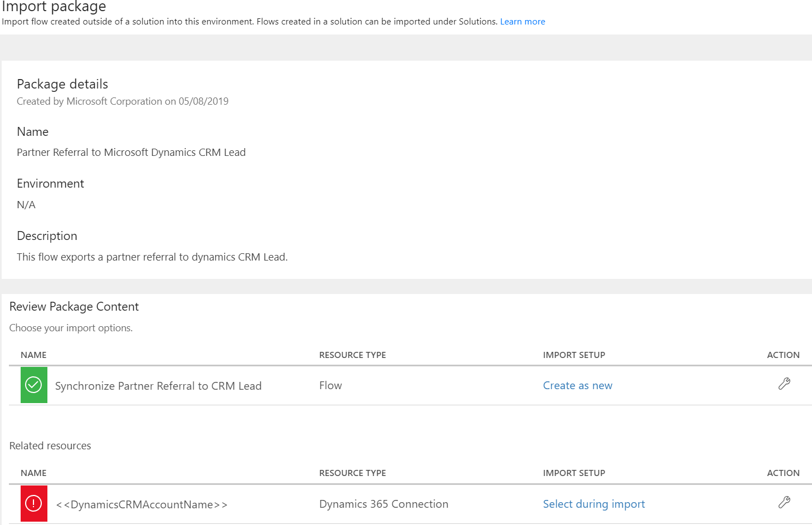

# Referral Connectors

You can use referral connectors to determine connections between partner referrals and customer relationship management (CRM) leads from Microsoft Dynamics 365.

## Prerequisites

* [Dynamics 365](https://dynamics.microsoft.com/) subscription
  * Sales module enabled
  * Account with administrator access to this subscription
* [Microsoft Flow](https://flow.microsoft.com) subscription
  * Account with administrator access to this subscription
* An Azure Active Directory (Azure AD) application ID, secret key and tenant ID. These values are used to access the Partner API. If you don't have these already, see [Partner authentication](api-authentication.md) for setup instructions.
* A [Partner Center webhook event](https://docs.microsoft.com/en-us/partner-center/develop/partner-center-webhook-events) subscription to [Referral Created](https://docs.microsoft.com/en-us/partner-center/develop/partner-center-webhook-events#referral-created-event) and [Referral Updated](https://docs.microsoft.com/en-us/partner-center/develop/partner-center-webhook-events#referral-updated-event) events.

## End to end flow

The following flow chart shows the process of importing referrals into the CRM.


## Flow document process

A connector does the following to synchronize a partner referral with a CRM lead from Dynamics 365:

1. Obtains a token to connect to [https://api.partner.microsoft.com/v1.0/engagements/referrals](https://api.partner.microsoft.com/v1.0/engagements/referrals).
2. Obtains the referral which triggered the connector using [https://api.partner.microsoft.com/v1.0/engagements/referrals/{id}](https://api.partner.microsoft.com/v1.0/engagements/referrals/{id}).
3. Connects to Dynamics 365.
4. Creates a new lead or updates an existing lead with the latest information on the referral.
5. Updates the referral with the latest updates from the CRM lead.

The following flow chart shows each step in this synchronization process:


## Download flow synchronization package

Download the [flow synchronization package](https://github.com/microsoft/Partner-Center-Referrals/blob/master/flowconnectors/MicrosoftDynamicsCRM/PartnerReferralsToDynamicsCRMLead.zip?raw=true) from the GitHub repository.

### Import flow synchronization package

Import the package into Microsoft Flow:

1. Sign in to [Microsoft Flow](https://flow.microsoft.com) using the appropriate credentials.
2. Choose **My Flows** in the navigation menu.
3. Choose **Import**.
4. On the **Import package** page, select the flow synchronization package that you downloaded. Then choose **Upload**.

    

5. After the package upload is complete, find the package you uploaded in the **Review Package Content** .

    

6. Choose the **Action** button (pencil icon) for your uploaded package. This opens the **Import setup** blade.
7. Choose your **Setup** type.

    * To create a new flow, select **Create as new**, and enter a new **Resource name**.
    * To update an existing flow with the same name, select **Update**.

    

8. On the **Import package** page, find your Dynamics 365 connection in the **Review Package Content** section under **Related Resources**.
9. Choose the **Action** button (pencil icon) for your Dynamics 365 connection. This opens the **Import setup** blade for this related resource.
10. Choose **Create new** to create a new Dynamics 365 connection, or select an existing connection.
11. Verify that the **Import package** page now shows your selected flow setup type and Dynamics 365 connection. Then choose **Import**.

    

12. Verify that your flow resource is now created or updated.
13. Setup a [logic app](https://azure.microsoft.com/en-us/services/logic-apps) to [authenticate the call back](https://docs.microsoft.com/en-us/partner-center/develop/partner-center-webhooks#how-to-authenticate-the-callback).

### Configure flow parameters

Configure the parameters of your flow resource:

1. In [Microsoft Flow](https://flow.microsoft.com), choose **My Flows** in the navigation menu.
2. Choose the flow resource you created or updated in the previous section.
3. On the flow page, choose **Edit flow**.
4. Choose the **AAD-Application (client) ID** variable and enter the ID of the Azure AD application.
5. Choose the **AAD-Application (client) Secret** variable and enter the secret key of the Azure AD application.
6. Select **AAD-Directory (tenant) ID** variable and enter the tenant ID of Azure AD application.
7. Choose **Save**.
8. Select **webhook certificate validation** and enter the logic app url.
9. Save the flow.

    

### Register flow with Partner Center

Register the flow resource with the Partner Center to trigger the flow and receive webhook events:

1. In [Microsoft Flow](https://flow.microsoft.com), choose **My Flows** in the navigation menu.
2. Choose the flow you created or updated.
3. On the flow page, choose **Edit flow**.
4. Copy and save the flow's **HTTP POST URL**. You will need to use this URL to trigger the flow.
5. [Register to receive webhook events](https://api.partnercenter.microsoft.com/webhooks/v1/registration) when referrals are created or updated. Use the following body format:

```json
{
    "WebhookUrl": "<<FlowUrl>>",
    "WebhookEvents": [
        "referral-created",
        "referral-updated"
    ],
    "signatureTokenToMsSignatureHeader": true
}
```