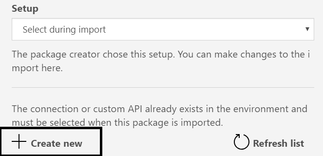

# Referral connectors

You can use referral connectors to synchronize partner referrals with customer relationship management (CRM) leads. You can create a referral connector using [Microsoft Flow](https://flow.microsoft.com) as the HTTPS endpoint to receive partner referrals. You can then write the referral leads received by the flow to a CRM system.

## Prerequisites

* Microsoft Flow subscription
  * Account with administrator access to this subscription
* [Azure Logic Apps](https://azure.microsoft.com/services/logic-apps) subscription. For setup instructions, see the [Azure Logic Apps quickstart guide](https://docs.microsoft.com/en-us/azure/logic-apps/quickstart-create-first-logic-app-workflow).
* Azure Active Directory (Azure AD) application ID, user id, password and tenant ID (used to access the Partner API). For setup instructions, see [Partner authentication](api-authentication.md).
* [Partner Center webhook event](https://docs.microsoft.com/en-us/partner-center/develop/partner-center-webhook-events) subscription to [Referral Created](https://docs.microsoft.com/en-us/partner-center/develop/partner-center-webhook-events#referral-created-event) and [Referral Updated](https://docs.microsoft.com/en-us/partner-center/develop/partner-center-webhook-events#referral-updated-event) events.
* [Microsoft Dynamics 365](https://dynamics.microsoft.com) subscription
  * Sales module enabled
  * Account with administrator access to this subscription

## Flow overview

Referrals are imported into the CRM using the following flow:

1. The partner sets up a webhook to receive referral notifications.
2. The partner registers the webhook with Partner Center. The partner also subscribes to webhook events for when referrals are created or updated.
3. The referral client creates or updates a referral.
4. The Partner Center webhook system checks for the partner's registration and sends a notification to the webhook.
5. The webhook receives the notification.
6. The flow document in Microsoft flow uses a token to make a call to the Partner Center referral API.
7. The flow endpoint gets the referral.
8. The flow endpoint creates the CRM lead.


## Flow document process

The flow document for a referral connector synchronizes a partner referral with a CRM lead from Dynamics 365.

1. The connector obtains a token to connect to `https://api.partner.microsoft.com/v1.0/engagements/referrals`.
2. The connector obtains the referral that triggered the connector using `https://api.partner.microsoft.com/v1.0/engagements/referrals/{id}`.
3. The connector connects to Dynamics 365.
4. The connector creates a new lead or updates an existing lead with the latest information on the referral.
5. The connector updates the referral with the latest updates from the CRM lead.


## Sample referral connector

The following *sample referral connector* shows how to synchronize Partner Center referrals to CRM leads in Dynamics 365.

> [!IMPORTANT]
> You can write to different CRMs by replacing the [flow connectors](https://flow.microsoft.com/en-us/connectors/) in the sample code.

### Import flow synchronization package

Download and import the *sample code package* into Microsoft Flow and connect to Dynamics 365:

1. Download the [flow synchronization package](https://github.com/microsoft/Partner-Center-Referrals/blob/master/flowconnectors/MicrosoftDynamicsCRM/PartnerReferralsToDynamicsCRMLead.zip?raw=true) from the [GitHub repo](https://github.com/microsoft/Partner-Center-Referrals).
2. Sign in to [Microsoft Flow](https://flow.microsoft.com) using the appropriate credentials.
3. Choose **My Flows** in the navigation menu. Then choose **Import**.
4. On the **Import package** page, select the flow synchronization package that you downloaded. Then choose **Upload**.

    

5. After the package upload is complete, find the package you uploaded in the **Review Package Content** .

    

6. Choose the **Action** button (pencil icon) for your uploaded package. This opens the **Import setup** blade.
7. Choose your **Setup** type.

    * To create a new flow, select **Create as new**, and enter a new **Resource name**.
    * To update an existing flow with the same name, select **Update**.

    

8. On the **Import package** page, find your Dynamics 365 connection in the **Review Package Content** section under **Related Resources**.
9. Choose the **Action** button (pencil icon) for your Dynamics 365 connection. This opens the **Import setup** blade for this related resource.
10. Choose **Create new** to create a new Dynamics 365 connection, or select an existing connection.
11. Verify that the **Import package** page now shows your selected flow setup type and Dynamics 365 connection. Then choose **Import**.

    

12. Verify that your flow resource is now created or updated.
13. Set up an Azure Logic App to [authenticate the callback event from the Partner Center](https://docs.microsoft.com/en-us/partner-center/develop/partner-center-webhooks#how-to-authenticate-the-callback).

### Configure flow parameters

Configure the parameters of your flow resource:

1. In [Microsoft Flow](https://flow.microsoft.com), choose **My Flows** in the navigation menu.
2. Choose the flow resource you created or updated in the previous section.
3. On the flow page, choose **Edit flow**.
4. Choose the **AAD-Application (client) ID** variable and enter the ID of your Azure AD application.
5. Choose the **UserId** variable and enter your user ID.
6. Choose the **UserPassword** variable and enter your user password.
7. Select the **AAD-Directory (tenant) ID** variable. Enter the tenant ID of your Azure AD application.
8. Choose **Save**.
9. Select **webhook certificate validation** and enter the URL of your Azure Logic App.
10. Save your flow.

    

### Register flow with Partner Center

Register your flow resource with the Partner Center to trigger the flow and receive webhook events:

1. In [Microsoft Flow](https://flow.microsoft.com), choose **My Flows** in the navigation menu.
2. Choose the flow you created or updated.
3. On the flow page, choose **Edit flow**.
4. Copy and save the flow's **HTTP POST URL**. You will need to use this URL to trigger the flow.
5. [Register to receive webhook events](https://docs.microsoft.com/en-us/partner-center/develop/partner-center-webhooks#register-to-receive-events) when referrals are created or updated. Use the following body format:

```json
{
    "WebhookUrl": "<<FlowUrl>>",
    "WebhookEvents": [
        "referral-created",
        "referral-updated"
    ],
    "signatureTokenToMsSignatureHeader": true
}
```